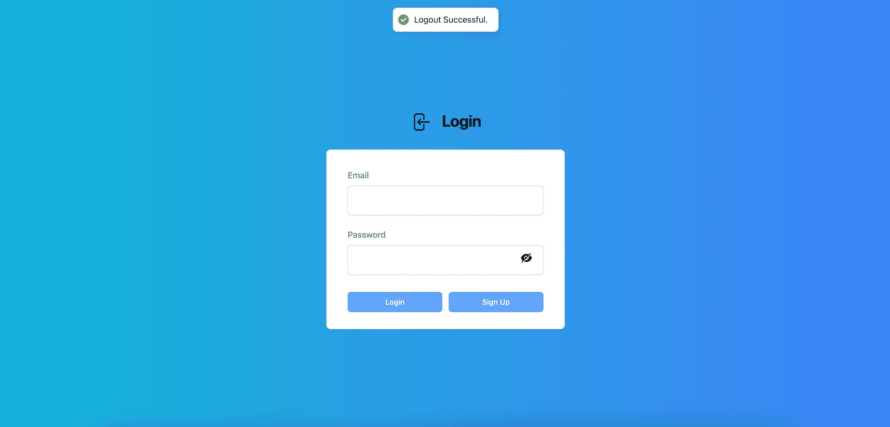

# Weather Application Practice

## Description

This project is a weather application that is built based on the tutorials listed in the reference section. Users can sign up or log in to check weather conditions around the world. The techniques used in the project are _the MERN stack (MongoDB, Express, React, and Node. js)_.

## Prerequisites

- Node.js
- Yarn
- npm

## Dependency

### Frontend Dependency

1. Create React App:
```bash
yarn create vite
```

```bash
cd client
```

```bash
yarn install
```

2. Install Tailwind CSS (https://tailwindcss.com/docs/guides/vite):

```bash
npm install -D tailwindcss postcss autoprefixer
```

```bash
npx tailwindcss init -p
```

- Go to tailwind.config.js and add:

```bash
  content: [
    "./src/**/*.{js,jsx,ts,tsx}",
  ],
```

- Go to index.css and add:

```bash
@tailwind base;
@tailwind components;
@tailwind utilities;
```

3. Install Axios:

```bash
npm i axios
```

4. Install react-router DOM:

```bash
npm i react-router-dom
```

5. Install react icons for common icons:

```bash
npm i react-icons
```

6. Install Lodash utility library:

```bash
npm i lodash
```

7. Install react hot toast for interface notification:

```bash
yarn add react-hot-toast
```

### Backend Dependency

1. Install ExpressJS:

```bash
npm i express
```

2. Install dotenv for env configuration:

```bash
npm i dotenv
```

3. Install CORS on the server to connect two different hosts:

```bash
npm i cors
```

4. Install mongoose to connect to MongoDB:

```bash
npm i mongoose
```

5. Install nodeman to monitor the changes made on the server:

```bash
yarn global add nodemon
```

```bash
nodemon index.js
```

6. Install bcrypt to encrypt the password (hashed password) and compare passwords during login:

```bash
npm i bcrypt
```

7. Install jsonwebtoken for JSON web token (JWT):

- Implement cookies to a specific user and track them throughout the application:

```bash
npm i jsonwebtoken
```

- Initialize cookie parser allowing the cookies to go back from one host to another:

```bash
npm i cookie-parser
```

## Project Directory

```
client
├── src
│   ├── context/
│   ├── components/
│   ├── pages/
│   ├── App.jsx
│   └── main.jsx
├── index.html
├── .env
└── configuration(s)
```

---

```
server
├── controllers
│   └── authController.js
├── models
│   └── User.js
├── routes
│   └── authRoutes.js
├── index.js
├── .env
└── configuration(s)
```

## Functionality

### Use JWT to Protect APIs

1. Assign the current user a JSON web token only when ___logged in___:

> - If the passwords match, we sign the token with the user email, name, and _id, and a pre-defined JWT secret.

> - Set the signed token to cookies and send them back to the frontend.

2. Share cookies throughout the application:

> - Access cookies throughout the whole application using _useContext_ in React. We can have user information on any page the users go to if they are logged in.

3. Authentication control:

> - Require the client to have the token in the header of each request.

> - If there is a token in the cookie, we first verify the token with a JWT secret. Then we can obtain user information.

> - If there is no token in the cookie, we redirect users to the login page.

4. Jump to the login page if not already logged in:

> - We check user information from the context. If user information is null, then we navigate users to the login page.

> - However, since we use _useEffect_ to fetch the user information from the backend, which is an asynchronous function and takes about 20 milliseconds, the website will always be redirected to the login page due to this delay.

> - To overcome this delay and keep users on the current page if they are already logged in, we need to define another state "ready" in the context and set "ready" to true after we set user information. Then on each page, if "ready" is true and user information is null, then we can redirect the users to the login page.

5. Logout:

> - Reset cookies to an empty string.

> - Navigate back to the login page.

### Frontend Password Toggling for Better User Experience

## Demo

### Sign Up Page (with password toggling)


<!-- ### Login Page

 -->

### React Toast Notification

> (1) Login user not found:


> (2) Sign up user is missing:


> (3) Log out successful:



### Search for Cities


### Check the Weather


## Resources

- Icons: https://heroicons.com/

- OpenWeather: https://openweathermap.org/api

## References

- https://www.youtube.com/watch?v=XPC81RWOItI

- https://www.youtube.com/watch?v=tfrxfnUEM7U

- https://www.youtube.com/watch?v=MpQbwtSiZ7E

- https://www.youtube.com/watch?v=J4WSmVX6Lhg

## Notes

This repository is for learning purposes only.
